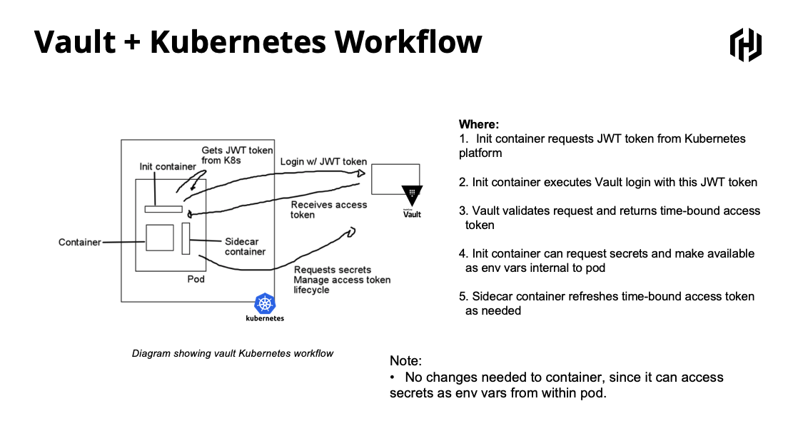

# Vault + Kubernetes Workflow

This code shows how a Kubernetes (Or Openshift, or EKS, etc) pod can authenticate with Vault and retrieve secrets. It will write and retrieve static secret in a pod-id space and in a more general Kubernetes space, which allows sharing static secrets between pods.

The following diagram describes this workflow:



## Installation
### Install VirtualBox and MiniKube
Since this is a demo we will use mikikube, which allows us to have a small scale Kubernetes deployment in a local machine. In order to do that, you will need to have VirtualBox installed.

For this demo we will run Vault in demo mode.

#### VirtualBox
1. Go to https://www.virtualbox.org/wiki/Downloads
2. Download the binary for your platform
3. Install the application

#### MiniKube
1. Perform the checks, download binary and install as described here https://kubernetes.io/docs/tasks/tools/install-minikube/

### Vault
1. Go to https://www.vaultproject.io/downloads.html
2. Download the binary for your platform
3. Add to your PATH or copy the binary to this folder

## Setup:
### Vault
```bash
# This will run Vault in demo mode with root token as "root"
vault server -dev -dev-root-token-id=root -dev-listen-address=localhost:8200 -log-level=DEBUG

```
### Minikube

Open a terminal tab, and configure minikube
```bash
# This should take a few seconds as VM is initialized
minikube start


# create namespaces
kubectl create namespace ns1
kubectl create namespace ns2

# create our service account and role binding
kubectl create serviceaccount vault-auth
kubectl create serviceaccount vault-auth --namespace="ns1"
kubectl create serviceaccount vault-auth --namespace="ns2"

kubectl apply --filename clusterRoleBinding_mod.yml 
```
Now ensure that this tab can talk to Vault
```bash
export VAULT_SERVER=http://localhost:8200
export VAULT_TOKEN=root
```

### Back to Vault

```bash
# Getting Vault service account name you created earlier
## Now we will get the name of the Vault service account inside kubernetes:
kubectl get sa vault-auth
## Exporting to an environment variable VAULT_SA_NAME:
export VAULT_SA_NAME=$(kubectl get sa vault-auth -o jsonpath="{.secrets[].name}")

# Getting the JWT token associated with this service account:
kubectl get secret $VAULT_SA_NAME -o json
## Set SA_JWT_TOKEN value to the service account JWT used to access the TokenReview API
export SA_JWT_TOKEN=$(kubectl get secret $VAULT_SA_NAME -o jsonpath="{.data.token}" | base64 --decode; echo)

# Getting the CA certificate used to communicate from outside kubernetes
kubectl get secret $VAULT_SA_NAME -o json
## Set SA_CA_CRT to the PEM encoded CA cert used to talk to Kubernetes API
export SA_CA_CRT=$(kubectl get secret $VAULT_SA_NAME -o jsonpath="{.data['ca\.crt']}" | base64 --decode; echo)

# Set K8S_HOST to minikube IP address
export K8S_HOST=$(minikube ip)

export VAULT_ADDR=http://localhost:8200 
vault login root

vault audit enable file file_path=/tmp/vault.log

vault auth enable kubernetes

# Notice the env vars.  These were set in the previous section.  Make sure they are present if you have multiple terminals open
vault write auth/kubernetes/config \
        token_reviewer_jwt="$SA_JWT_TOKEN" \
        kubernetes_host="https://$K8S_HOST:8443" \
        kubernetes_ca_cert="$SA_CA_CRT"

vault write auth/kubernetes/role/demo \
    bound_service_account_names=vault-auth \
    bound_service_account_namespaces=* \
    policies=read_ns \
    ttl=1h

vault secrets enable -version=1 kv
vault kv put kv/default my-value=s3cr3t
vault kv put kv/ns1 my-value=s3cr3t
vault kv put kv/ns2 my-value=s3cr3t
vault kv put kv/default/test my-value=s3cr3t
vault kv put kv/ns1/test my-value=s3cr3t
vault kv put kv/ns2/test my-value=s3cr3t

KUB_MOUNT_ACCESSOR=$(vault auth list -format=json | jq -r '.["kubernetes/"].accessor') && echo $KUB_MOUNT_ACCESSOR

tee -a "read_ns.hcl" <<EOF

path "kv/{{identity.entity.aliases.$KUB_MOUNT_ACCESSOR.metadata.service_account_namespace}}/*" {
  capabilities = ["create", "update", "read", "delete", "list"]
}
EOF

vault policy write read_ns read_ns.hcl

```

### Back to Kube

```bash
kubectl run shell-demo --generator=run-pod/v1 --rm -i --tty --serviceaccount=vault-auth --image ubuntu:latest --env="VAULT_ADDR=http://10.0.2.2:8200" --namespace="ns1"

# In shell
apt-get update && apt-get install -y jq curl unzip wget less
wget https://releases.hashicorp.com/vault/1.0.2/vault_1.0.2_linux_amd64.zip -O vault.zip
unzip vault.zip && cp vault /usr/local/bin/vault
vault status

# Get our service account token
KUBE_TOKEN=$(cat /var/run/secrets/kubernetes.io/serviceaccount/token)

# Login
TOKEN=$(curl --request POST \
  --data '{"jwt": "'"$KUBE_TOKEN"'", "role": "demo"}' \
  $VAULT_ADDR/v1/auth/kubernetes/login | jq .auth.client_token | tr -d '"') && echo $TOKEN

vault login $TOKEN

# get our entity and namespace
ENTITY_ID=$(curl --header "X-Vault-Token: $TOKEN" $VAULT_ADDR/v1/auth/token/lookup-self |jq .data.entity_id | tr -d '"') && echo $ENTITY_ID

K8S_NAMESPACE=$(curl --header "X-Vault-Token: $TOKEN" $VAULT_ADDR/v1/auth/token/lookup-self |jq .data.meta.service_account_namespace |tr -d '"') && echo $K8S_NAMESPACE

vault kv put kv/$ENTITY_ID/test my=val
vault kv put kv/$K8S_NAMESPACE/test my=val

vault kv get kv/$ENTITY_ID/test

vault kv get kv/$K8S_NAMESPACE/test

META=$(curl --header "X-Vault-Token: $TOKEN" $VAULT_ADDR/v1/auth/token/lookup-self |jq .data.meta)

echo "$(tput setaf 3)My Metadata: $(tput setaf 3)" && echo $META |jq

```

## Additional Information

The file [example-pod.yml](./example-pod.yml) shows how a pod can be configured to leverage init and sidecar containers to externalize Vault logic

An example using dynamic secrets can be found [here](https://medium.com/@gmaliar/dynamic-secrets-on-kubernetes-pods-using-vault-35d9094d169).

You can also automate this workflow by configuring Kubernetes Mutating Admission Controller, as described [here](https://blog.openshift.com/integrating-vault-with-legacy-applications/). 